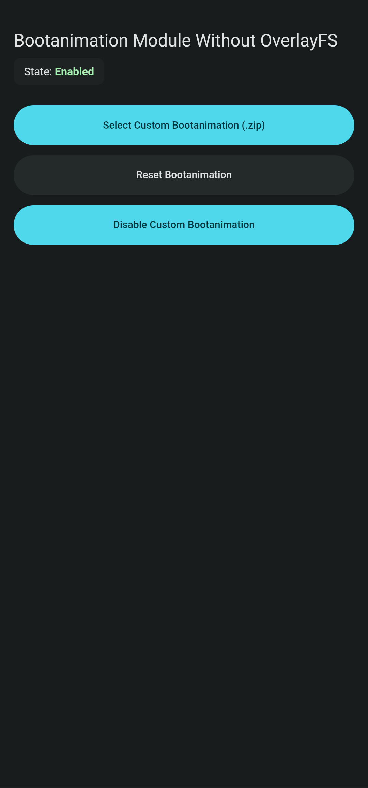
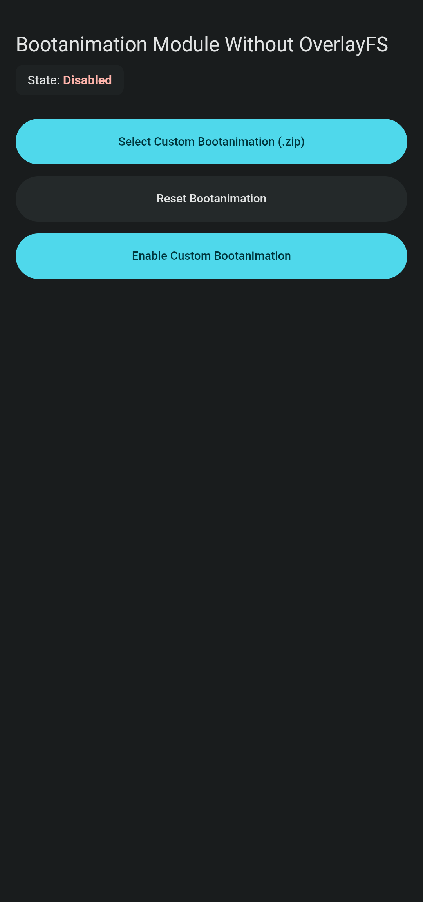
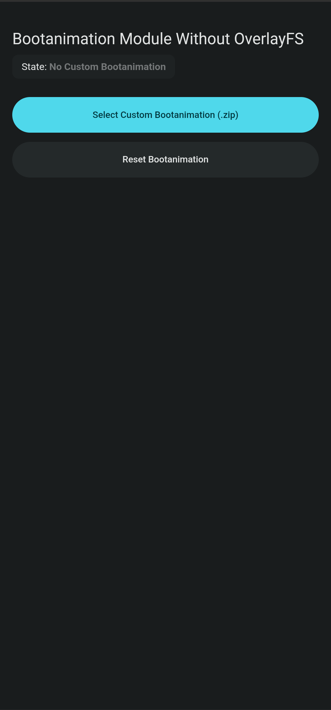
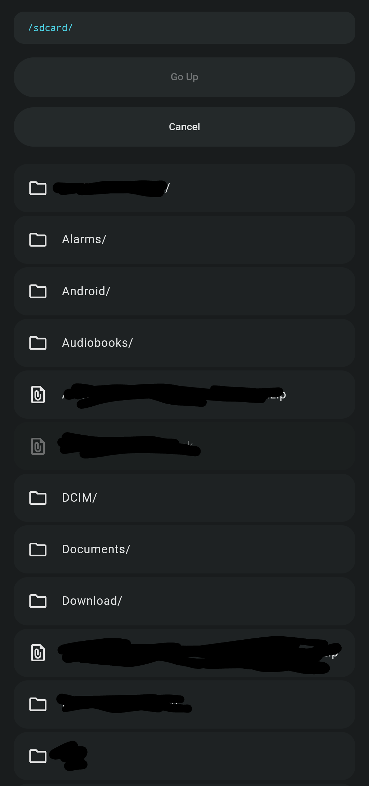

---

#  🌌 • Bootanimation Module without OverlayFS

[English](README.md) | Türkçe

---

Bu modül [meta-overlayfs](https://github.com/KernelSU-Modules-Repo/meta-overlayfs) ve [Magisk Magic Mount](https://topjohnwu.github.io/Magisk/details.html)'a gerek kalmadan bootanimasyonunu modifiye etmenizi sağlar.

>[!CAUTION]
> Bu modül yüzünden bozulmuş cihazlardan, bozulmuş SD kartlardan veya herhangi bir hasardan sorumlu değilim. Kullanım sorumluluğu size aittir.

> Bu modül [Magisk](https://github.com/topjohnwu/Magisk), [KernelSU](https://github.com/tiann/KernelSU) ve [APatch](https://github.com/bmax121/APatch) ile uyumludur

### 📙 • Bu dokümantasyon şunları içerir;
- [🌟 • Özellikler](#--özellikler)
- [📱 • Test Edilmiş Cihazlar](#--test-edilmiş-cihazlar)
- [🖥️📲 • Modülü Nasıl indiririm?](#%EF%B8%8F--modülü-nasıl-indiririm)
- [🔧📲 • Kurulum](#--kurulum)
- [📱 • Kullanım](#--kullanım)
- [❓ • Nasıl çalışır](#--nasıl-çalışır)
- [🤝 • Lisanslar](#--lisanslar)


---

# 🌟 • Özellikler

- OverlayFS gerekmez
- Magisk'i destekler
- KernelSU'yu destekler
- APatch'i destekler
- WebUI (Deneysel)
- Dinamik Bölüm Belirleme
- Basit CLI

---

# 📸 WebUI

<details markdown='1'><summary>WebUI görüntülerini göster</summary>

| Anasayfa (etkin) | Anasayfa (devre dışı) |
| :---: | :---: |
|  |  |

| Anasayfa (ayarlanmamış) | Anasayfa (devre dışı) |
| :---: | :---: |
|  |  |

</details>

---

# 📱 • Test Edilmiş Cihazlar

**Kök Yöneticisi:** KernelSU

**Yönetici Versiyonu:** v3.2.5 (32525-2)

**Cihaz:** Xiaomi Redmi Note 12 4G (tapas)

**Android Versiyonu:** Android 15 QPR2

**ROM:** Evolution-X 10.6

**Modül Versiyonu:** v1.1-stable

[Diğer Cihaz İncelemeleri](https://github.com/readonlynux/bootanimation-module/issues?q=state%3Aopen%20label%3Aworks)

---

# 🖥️📲 • Modülü Nasıl indiririm?

- Son sürümü [yayınlar](https://github.com/readonlynux/bootanimation-module/releases/latest) üzerinden indirin
- Kök yönetici uygulamanızı açın
- *Modüller* bölümüne gidin
- *Depolama alanından yükleyin*e tıklayın
- Modülü seçin
- Cihazı yeniden başlatın

---

# 🔧📲 • Kurulum

- Bir terminal emülatörü indirin (örneğin [Termux](https://f-droid.org/en/packages/com.termux/)) 
- Ve `su` komutunu terminal emülatörü üzerinden girin
-  Süper (Kök) kullanıcı yetkisini verin
	- Eğer KernelSU kullanıyorsanız, süper kullanıcı yetkisini uygulama üzerinden verin.

---

# 📱 • Kullanım

```bash
bootanim help
```

---

# ❓ • Nasıl Çalışır

`bootanim` komutu bootanimasyon dosyasını, `/data/adb/bootanimation` klasörüne kopyalar.

Her yeniden başlatmada, `post-fs-data.sh` yürütülür ve `bootanimation.zip` bağlanır.

---

# 🤝 • Lisanslar

Google tarafından Material Icons bu projede kullanılmıştır ve Apache License 2.0 ile lisanslanmıştır.
